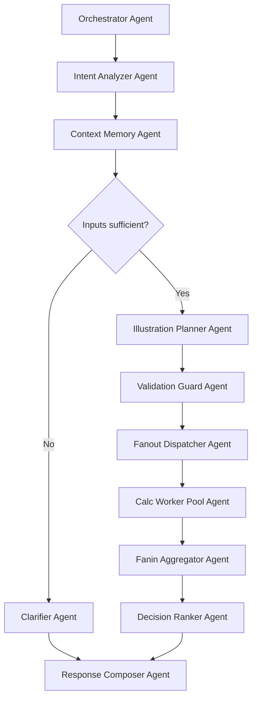
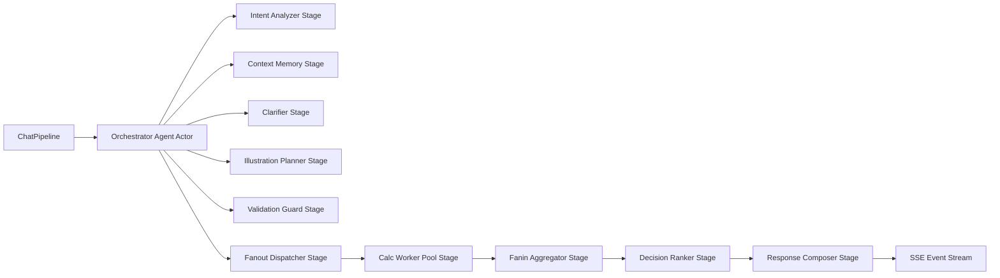
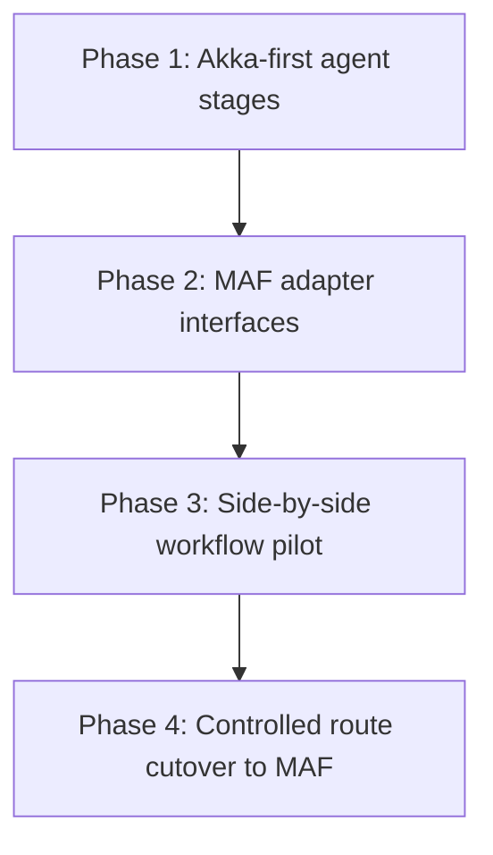

# MISA Agentic Architecture

## Target

Build an agentic runtime for MISA that preserves existing API/SSE contracts while evolving beyond a simple chatbot flow.

## Orchestration Decision

Current implementation strategy is **Akka-first** with **MAF-ready seams**.

- Why Akka first:
  - Existing runtime already uses Akka and passes parity tests.
  - Actor model fits fanout/fanin and partial-failure handling.
  - Lower migration risk while contracts remain stable.
- Why keep MAF seams:
  - MAF workflows can be introduced later for richer enterprise governance and tooling.
  - Keeps future migration path open without blocking immediate delivery.

## Agent Catalog

| Agent Name | One-line Explanation |
| --- | --- |
| Orchestrator Agent | Controls the full request lifecycle and decides which agents run and in what order. |
| Intent Analyzer Agent | Interprets user input and turns it into structured goals, route, and required tasks. |
| Context Memory Agent | Loads and updates session state, prior outputs, and user context for continuity. |
| Clarifier Agent | Asks focused follow-up questions when required inputs are missing or ambiguous. |
| Illustration Planner Agent | Builds the candidate illustration strategy and execution plan. |
| Validation Guard Agent | Performs prechecks and prepares safe fallback options before expensive execution. |
| Fanout Dispatcher Agent | Splits the plan into parallel work units and sends them to worker agents. |
| Calc Worker Pool Agent | Executes calculation jobs concurrently for each configuration or scenario. |
| Fanin Aggregator Agent | Collects parallel results, handles partial failures, and normalizes outputs. |
| Decision Ranker Agent | Scores all candidates and selects the best recommendation set. |
| Response Composer Agent | Combines decision output with knowledge and policy checks, then produces final stream output. |

## Lifecycle Flow

## Akka Runtime Topology

## Akka to MAF Evolution Path

## Contracts to Preserve

- Route paths remain stable: `irt/chat`, `irt/chat/session/{sessionId}`, `irt/health`.
- SSE event wire names remain stable: `thinking`, `progress`, `assumptions`, `prevalidation`, `clarification`, `question`, `result`, `columns`, `error`.
- Request/response payload compatibility remains strict for current gateway/UI consumers.

## Current Code Landmarks

- Entry and DI wiring: `src/MISA.Functions/Program.cs`
- HTTP + SSE boundary: `src/MISA.Functions/ChatFunctions.cs`
- Akka orchestration runtime: `src/MISA.Orchestration.Akka/AkkaClusterExecutionRuntime.cs`
- Core pipeline abstractions: `src/MISA.Application/ChatPipelineAndContracts.cs`
- Contract DTOs: `src/MISA.Contracts/ChatContracts.cs`
