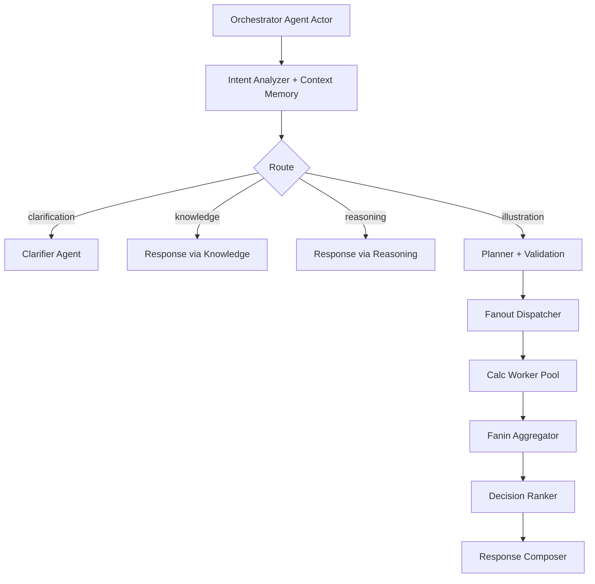

# MISA.Orchestration.Akka

## Purpose

Implements Akka-first orchestration runtime for the MISA agentic lifecycle.

## Key File

- `AkkaClusterExecutionRuntime.cs`

## Current Agentic Stage Mapping

- Orchestrator Agent: actor entrypoint and route dispatch.
- Intent Analyzer Agent + Context Memory Agent: route resolution plus session lookup.
- Clarifier Agent: insufficient-input follow-up branch.
- Illustration Planner Agent: assumptions and plan framing.
- Validation Guard Agent: pre-check for illustration sufficiency.
- Fanout Dispatcher Agent + Calc Worker Pool Agent: concurrent decisioning and knowledge tasks.
- Fanin Aggregator Agent: merge parallel outputs.
- Decision Ranker Agent: select ranked recommendation set.
- Response Composer Agent: final markdown/SSE result construction.

Implementation note: each listed stage is now backed by a dedicated child actor under `OrchestratorAgentActor`, and orchestrator-to-stage communication uses Akka `Ask` message flow.

## Runtime Flow



## Verification

```bash
dotnet test MISA_Agentic.slnx -c Release --filter "ClassName=MISA.ArchitectureTests.SseContractParityTests"
```

## Runtime Tuning

The fanout path supports bounded concurrency and timeout/fallback behavior through environment variables:

- `MISA_AGENTIC_CALC_WORKER_COUNT` (default: `4`)
- `MISA_AGENTIC_CALC_WORKER_TIMEOUT_MS` (default: `5000`)
- `MISA_AGENTIC_CALC_BRANCH_TIMEOUT_MS` (default: `6000`)
- `MISA_AGENTIC_KNOWLEDGE_TIMEOUT_MS` (default: `2500`)

When a branch times out or fails, orchestration emits a prevalidation warning and continues with resilient fallback output.
